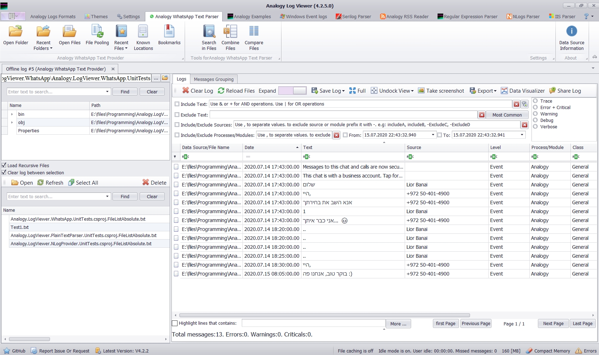

# Analogy.LogViewer.WhatsApp   

 

 

WhatsApp Exported chats Parser
Export your chat and load it in this data provider.

Initial parser based on [this repo](https://github.com/spoon611/WhatsAppChatParser).

screenshot:

